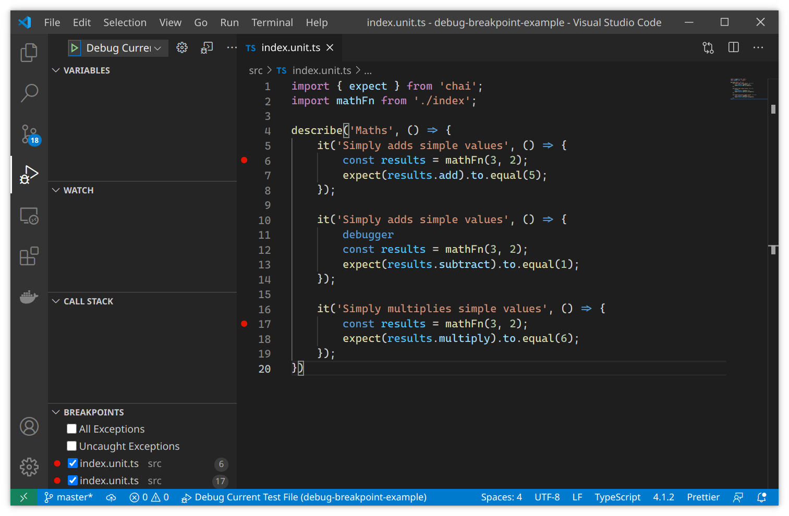
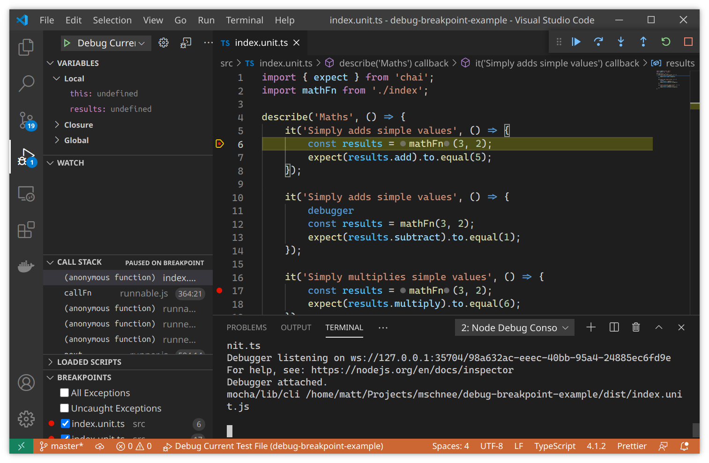
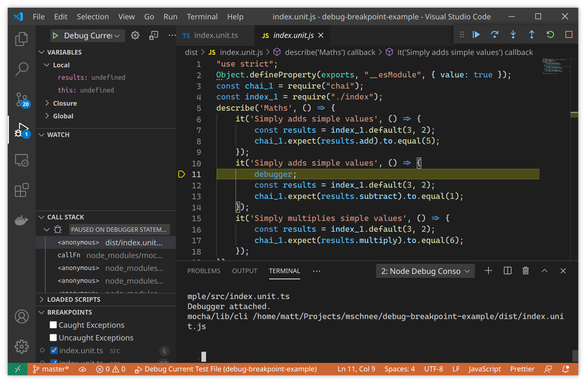

This repository exposes an issue with using `vscode-js-debug` in the cases where `program` is a wrapper used to determine an actual file.

For purposes of the example, the compiled files and sourcemaps are available in `./dist`

# Setup
```
npm install
```

# The Problem

Given the configuration
```json
{
  "type": "node",
  "request": "launch",
  "name": "Debug Current Test File",
  "program": "${workspaceFolder}/bin/mocha-current-file",
  "args": [
    "${file}"
  ],
  "outFiles": [
    "${workspaceFolder}/dist"
  ],
  "sourceMaps": true,
}
```

The file [./bin/mocha-current-file.js](./bin/mocha-current-file) does the following:
  - consumes the `${file}` argument, which is the currently focused file in the vscode editor.  In this example, it is `src/index.unit.ts`
  - determines the name and location of the compiled typescript file, in this case, `dist/index.unit.js`
  - Shows an (unfollowed) example of a setup where there might be complicated "before all test" setup, e.g. for cleanly creating and tearing down databases.
  - invokes mocha through `require('mocha/lib/cli').main(['dist/index.unit.js])`

You can substitute your favorite test framework, this also happens with Jest and AVA.


## Examples
Given these breakpoints:

## When not using the preview.
```jsonc
// settings.json
{
    "debug.javascript.usePreview": false,    
}
```


Note how we are currently stopped on the breakpoint in the source file.

## When using the preview
```jsonc
// settings.json
{
    "debug.javascript.usePreview": false,    
}
```

Note how we are currently stopped on the `debugger;` line in the __compiled distfile__ [./dist/index.unit.js](./dist/index.unit.js)


# Traces
Traces are committed to [./tracefile.json](tracefile.json)